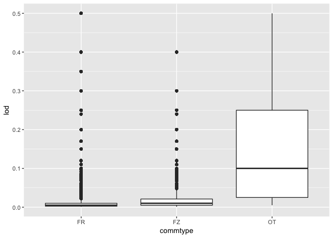
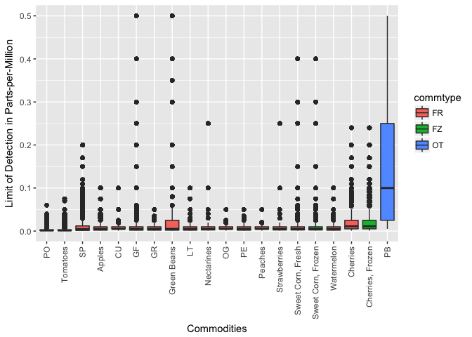

# Day37: Exploring pesticide residues in food

I want to take a look at pesticides today. The data I use comes from Kaggle's [Pesticide Data Program (2015)](https://www.kaggle.com/usdeptofag/pesticide-data-program-2015/kernels) data set uploaded by the United States Department of Agriculture.


```r
library(dplyr)
library(ggplot2)
library(DBI)
```


```r
con <- dbConnect(RSQLite::SQLite(), dbname="data/database.sqlite")
results <- dbGetQuery(con, 'SELECT * FROM resultsdata15')
dbDisconnect(con)
```


```r
code <- NULL
code$commod <-
  readr::read_csv("data/commodity_codes.csv",
                  col_names = c("code", "label", "sample_size"),
                  skip = 1)
```

### Glimpse of the data

Size of the data (rows, columns):


```r
dim(results)
```

```
## [1] 2333911      16
```


```r
head(results) %>%
  knitr::kable()
```


 sample_pk  commod   commtype   lab   pestcode   testclass   concen      lod  conunit   confmethod   confmethod2   annotate   quantitate   mean   extract   determin 
----------  -------  ---------  ----  ---------  ----------  -------  ------  --------  -----------  ------------  ---------  -----------  -----  --------  ---------
         2  AP       FR         WA1   382        E                     0.015  M                                                            ND     805       35       
         2  AP       FR         WA1   387        A                     0.005  M                                                            ND     805       35       
         2  AP       FR         WA1   388        A                     0.005  M                                                            ND     805       35       
         2  AP       FR         WA1   512        E                     0.003  M                                                            ND     805       52       
         2  AP       FR         WA1   529        A                     0.010  M                                                            ND     805       35       
         2  AP       FR         WA1   536        C                     0.001  M                                                            ND     805       52       

### Dealing with missing data


```r
# Replace empty string with NA
results[results==""] <- NA
```


```r
# How many NAs?
(na_in_column <-
  colSums(is.na(results))) %>%
  sort(decreasing = TRUE) %>%
  as.data.frame()
```

```
##                   .
## confmethod2 2333911
## quantitate  2331898
## annotate    2329076
## concen      2295160
## confmethod  2295160
## sample_pk         0
## commod            0
## commtype          0
## lab               0
## pestcode          0
## testclass         0
## lod               0
## conunit           0
## mean              0
## extract           0
## determin          0
```

```r
## Remove columns with NAs
results <- results[na_in_column==0]
```


```r
# Tidy data
results <-
  results %>%
  mutate(determin = gsub("[\r\n]", "", determin)) %>%
  tbl_df()
```

### The columns

- sample_pk
- commod - COMMODITY TYPE in 2015 PDP Samples
- commtype - COMMODITIES Sampled/Analyzed by PDP in 2015 (Fresh Product Unless Otherwise Noted)
- lab - PDP Participating LABORATORIES in 2015
- pestcode - Compounds (PESTICIDES) Analyzed by PDP
- testclass - TEST (COMPOUND) CLASS in 2015 PDP Analytical Results
- lod - Limit of Detection
- conunit - Concentration/LOD Unit-of-Measure Code
- mean - MEAN RESULT in 2014 PDP Analytical Results (O, A, and R indicated Positive Detections)
- extract - EXTRACTION METHOD in 2015 PDP Analytical Results
- determin - DETERMINATIVE METHOD in 2015 PDP Analytical Results

### A simple question

Which commodity type has the highest level of pesticides?


```r
# Check if the units are all the same
results$conunit %>% unique()
```

```
## [1] "M"
```

```r
results %>%
  ggplot(aes(x = commtype, y = lod)) +
  geom_boxplot()
```

<!-- -->

FR = Fresh, FZ = Frozen, OT = Other


```r
select(code$commod, code, label) %>%
  right_join(results, by = c("code"="commod")) %>%
  mutate(label = ifelse(is.na(label), code, label)) %>%
  plyr::rename(c("label" = "commod")) %>%

  ggplot(aes(x = reorder(commod, lod, FUN=median),
             y = lod, fill = commtype)) +
  geom_boxplot() +
  xlab("Commodities") +
  ylab("Limit of Detection in Parts-per-Million") +
  theme(
    axis.text.x = element_text(angle = 90, hjust = 1, vjust = 0.5)
  )
```

<!-- -->
