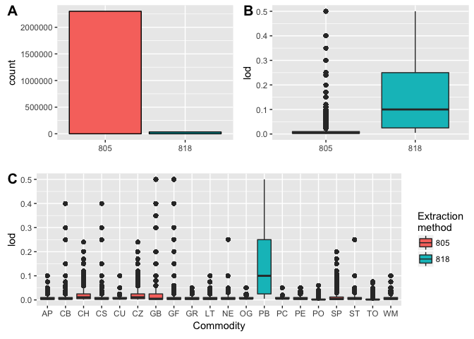
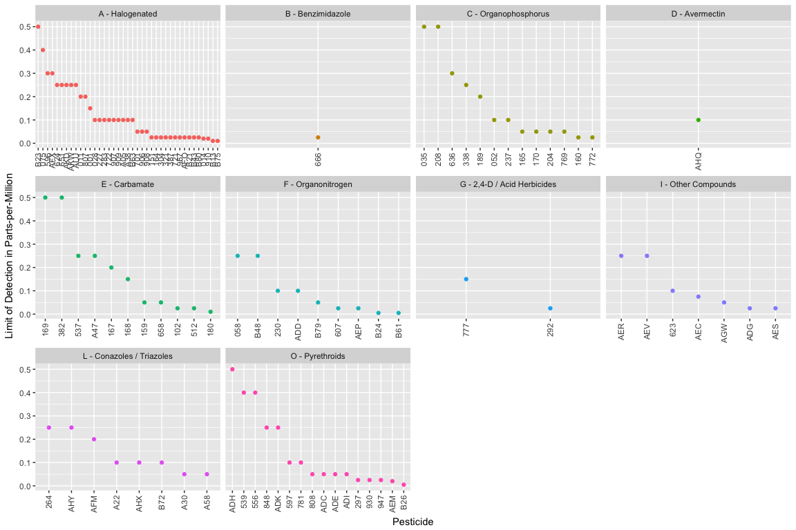
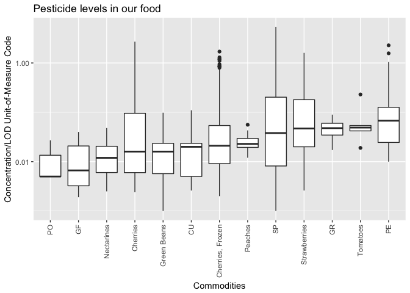

# Day38: Refinement

Today we will continue the exploration of pesticides today. The data I use comes from Kaggle's [Pesticide Data Program (2015)](https://www.kaggle.com/usdeptofag/pesticide-data-program-2015/kernels) data set uploaded by the United States Department of Agriculture.


```r
library(dplyr)
library(ggplot2)
library(DBI)
```


```r
con <- dbConnect(RSQLite::SQLite(), dbname="data/database.sqlite")
results <- dbGetQuery(con, 'SELECT * FROM resultsdata15')
dbDisconnect(con)
```


```r
code <- NULL
code$commod <-
  readr::read_csv("data/commodity_codes.csv",
                  col_names = c("code", "label", "sample_size"),
                  skip = 1)
code$testclass <-
  readr::read_csv("data/test_class_codes.csv",
                  col_names = c("code", "label"),
                  skip = 1)
```

### Pre-processing


```r
# Replace empty string with NA
results[results==""] <- NA

# ## Remove columns with NAs
# na_in_column <-
#   colSums(is.na(results))
# results <- results[na_in_column==0]

# Tidy data
results <-
  results %>%
  mutate(determin = gsub("[\r\n]", "", determin)) %>%
  tbl_df()
```

### Variable types

- 2,333,911 × 11

How much variety are in my variables?


```r
sapply(colnames(results), function(var){
  results[[var]] %>% unique() %>% length()
}) %>%
  {data.frame(var = names(.), n = .)} %>%
  arrange(desc(n))
```

```
##            var     n
## 1    sample_pk 10187
## 2       concen  2582
## 3     pestcode   489
## 4          lod   126
## 5       commod    20
## 6    testclass    20
## 7          lab     8
## 8     annotate     5
## 9     determin     5
## 10  confmethod     4
## 11        mean     4
## 12    commtype     3
## 13  quantitate     3
## 14     extract     2
## 15     conunit     1
## 16 confmethod2     1
```

- `n = 1` means no variability
- 2 different extraction methods (`extract`)

### Exploring the extraction methods


```r
results %>%
  count(extract)
```

```
## # A tibble: 2 × 2
##   extract       n
##     <chr>   <int>
## 1     805 2300206
## 2     818   33705
```

- 805 = MDA Modified QuEChERS Method
- 818 = NSL Animal Tissue Extraction Method


```r
p1 <-
  results %>%
  ggplot(aes(x=extract, fill=factor(extract))) +
  geom_bar(color="black") +
  xlab("") +
  theme(legend.position = "None")
p2 <-
  results %>%
  ggplot(aes(x=extract, y=lod, fill=factor(extract))) +
  geom_boxplot() +
  xlab("") +
  theme(legend.position = "None")
p3 <-
  results %>%
  ggplot(aes(x=commod, y=lod, fill=factor(extract))) +
  geom_boxplot() +
  labs(fill="Extraction\nmethod") +
  xlab("Commodity")

cowplot::ggdraw() +
  cowplot::draw_plot(p1, 0, .5, .5, .5) +
  cowplot::draw_plot(p2, .5, .5, .5, .5) +
  cowplot::draw_plot(p3, 0, 0, 1, .5) +
  cowplot::draw_plot_label(c("A", "B", "C"), c(0, 0.5, 0), c(1, 1, 0.5), size = 15)
```

<!-- -->

More samples extracted by MDA Modified QuEChERS Method (805) than NSL Animal Tissue Extraction Method (818).

The limit of detection by MDA Modified QuEChERS Method is lower meaning resolution is greater.

Only commodity extracted by NSL Animal Tissue Extraction Method (818) is "PB" (denoted as commodity type other from previous post).

### Exploring PB


```r
results_pb <-
  results %>%
  filter(commod == "PB")

dim(results_pb)
```

```
## [1] 33705    16
```

What are the differences?


```r
(num_distinct_pb <-
   sapply(colnames(results_pb), function(var){
     results_pb[[var]] %>% unique() %>% length()
   })
)
```

```
##   sample_pk      commod    commtype         lab    pestcode   testclass 
##         315           1           1           1         107          10 
##      concen         lod     conunit  confmethod confmethod2    annotate 
##           4          13           1           2           1           1 
##  quantitate        mean     extract    determin 
##           1           3           1           3
```

```r
num_distinct_pb <- results_pb[num_distinct_pb>1]
```

- only 1 lab does the extraction by PB the NSL Animal Tissue Extraction Method (818)


```r
results_pb %>%
  select(pestcode, lod, testclass) %>%
  unique() %>% 
  left_join(code$testclass, by=c("testclass" = "code")) %>% 
  mutate(testclass = sprintf("%s - %s", testclass, label)) %>%
  select(-label) %>%
  ggplot(aes(x = reorder(pestcode, -lod),
             y = lod,
             color = testclass)) +
  geom_point() +
  facet_wrap(~testclass, scales = "free_x") +
  xlab("Pesticide") +
  ylab("Limit of Detection in Parts-per-Million") +
  theme(
    legend.position = "None",
    axis.text.x = element_text(angle = 90, hjust = 1, vjust = 0.5)
  )
```

<!-- -->

- There are a number of Halogenated compounds and only a handful Benzimidazole, Avermectin, and 2,4-D / Acid Herbicides.

After exploring the data, I realized the pestcode, testclass, and lod are all linked. Mean is where the pesticide level information is.

### Pesticide level


```r
# Keep only data points with concentration info
results <-
  results %>%
  filter(!is.na(quantitate)) %>%
  mutate(
    concen = as.double(concen)
  )
```

I need to keep columns with missing information (these are my data points)

- concen - Concentration/LOD Unit-of-Measure Code
- quantitate - QUANTITATION METHOD in 2015 PDP Analytical Results
- annotate -ANNOTATED INFORMATION in 2015 PDP Analytical Results
- confmethod - CONFIRMATION METHOD in 2015 PDP Analytical Results
- confmethod2


```r
select(code$commod, code, label) %>%
  right_join(results, by = c("code"="commod")) %>%
  mutate(label = ifelse(is.na(label), code, label)) %>%
  plyr::rename(c("label" = "commod")) %>%
  
  ggplot(aes(x = reorder(commod, concen, FUN=median),
             y = concen,
             group = commod)) +
  geom_boxplot() +
  scale_y_log10() +
  xlab("Commodities") +
  ylab("Concentration/LOD Unit-of-Measure Code") +
  ggtitle("Pesticide levels in our food") +
  theme(
    axis.text.x = element_text(angle = 90, hjust = 1, vjust = 0.5)
  )
```

<!-- -->
