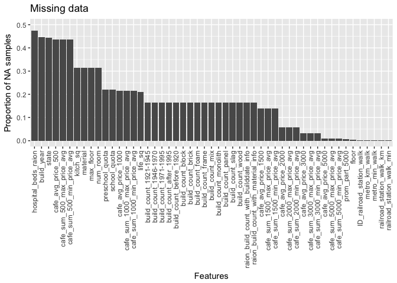
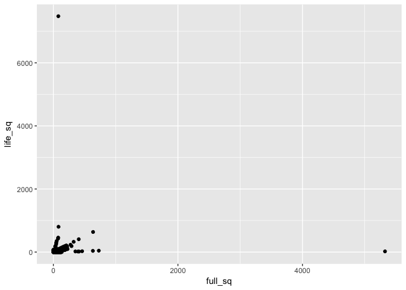
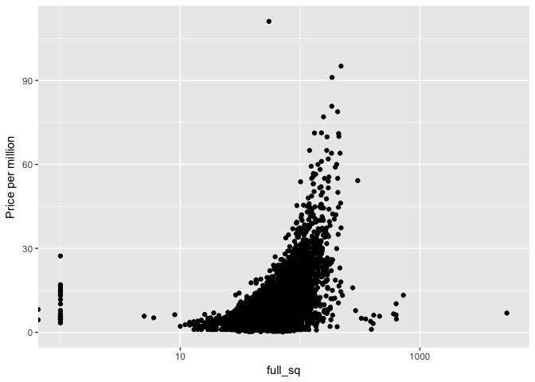
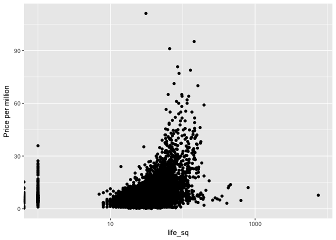
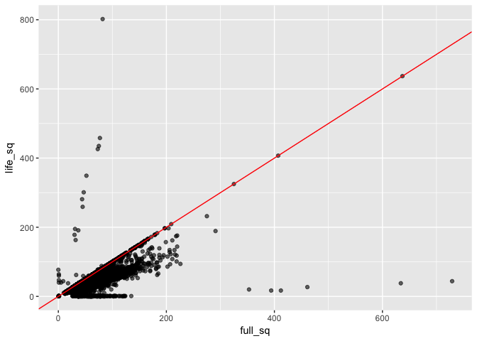
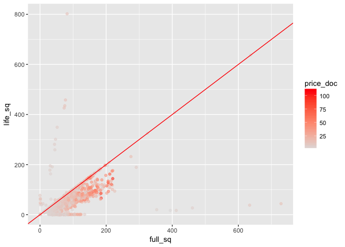
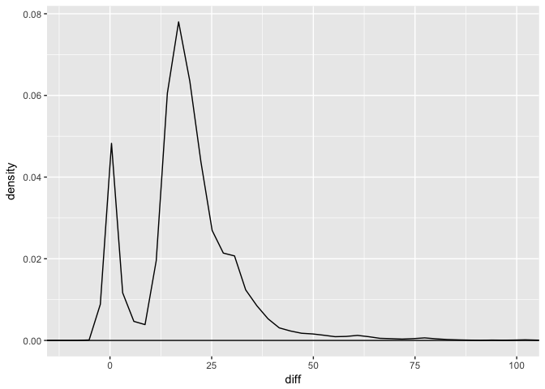
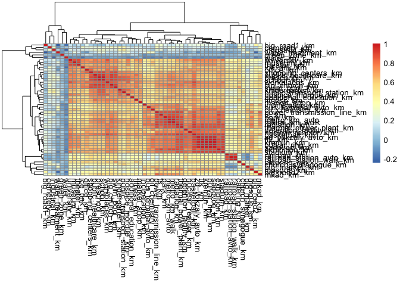

# Day62: Data exploration
csiu  
April 27, 2017  


```r
library(ggplot2)
library(dplyr)
library(readr)
library(tidyr)
library(pheatmap)
```


```r
# Load data
train <- read_csv("../input/train.csv")

num_samples <- nrow(train)
num_columns <- ncol(train)
paste("Number of samples:", num_samples, "&",
      "Number of columns:", num_columns)
```

```
## [1] "Number of samples: 30471 & Number of columns: 292"
```

## How complete is the data?


```r
(stat_missing_data <-
  train %>%
  summarise_each_(funs(is.na(.) %>% sum),
                  vars = paste0("`", colnames(train), "`")) %>%
  gather(column_name, num_na) %>%
  mutate(per_na = num_na/num_samples) %>%
  filter(num_na != 0)
) %>%

  ggplot(aes(x = reorder(column_name, -num_na),
             y = per_na)) +
  geom_bar(stat="identity") +
  ggtitle("Missing data") +
  coord_cartesian(ylim = c(0, 0.5)) +
  ylab("Proportion of NA samples") +
  xlab("Features") +
  theme(axis.text.x = element_text(angle=90, hjust=1, vjust=.5))
```

<!-- -->


```r
stat_missing_data %>%
  {nrow(.) / num_columns} %>%
  {sprintf("Proportion of columns containing at least 1 NA: %.2f", .)}
```

```
## [1] "Proportion of columns containing at least 1 NA: 0.17"
```

### What columns are there?

There are a lot of columns -- I wonder what they are. Let me try grouping the columns by name


```r
stat_class_type <-
  lapply(colnames(train), function(x){class(train[[x]])}) %>%
  unlist() %>%
  {data.frame(
    column_name = colnames(train),
    class_type = .
  )} %>%
  arrange(class_type, column_name)
```


```r
remove_column <- function(all_features, features_to_rm){
  paste0("^", features_to_rm, "$") %>%
  paste0(collapse = "|") %>%
  grep(all_features, value = TRUE, invert = TRUE)
}


train_columns <- colnames(train) %>%
  sort()

# write_lines(train_columns, "day63_features.txt")

features <- NULL
features$sex <- 
  grep("_female|_male|_all", train_columns, value = TRUE) %>%
  {grep("full_all", ., value = TRUE, invert = TRUE)}
train_columns <- remove_column(train_columns, features$sex)

features$distance <-
  grep("_km", train_columns, value = TRUE)
train_columns <- remove_column(train_columns, features$distance)

features$avg_price <-
  grep("avg", train_columns, value = TRUE)
train_columns <- remove_column(train_columns, features$avg_price)

features$raion <-
  grep("_raion$", train_columns, value = TRUE)
train_columns <- remove_column(train_columns, features$raion)

features$count <-
  grep("_count_", train_columns, value = TRUE)
train_columns <- remove_column(train_columns, features$count)

features$part <-
  grep("part", train_columns, value = TRUE)
train_columns <- remove_column(train_columns, features$part)

features$line1 <-
  grep("1line", train_columns, value = TRUE)
train_columns <- remove_column(train_columns, features$line1)

features$sqm <-
  grep("sqm", train_columns, value = TRUE)
train_columns <- remove_column(train_columns, features$sqm)


## The other columns
lapply(train_columns, function(x){class(train[[x]])}) %>%
  unlist() %>%
  {data.frame(
    column_name = train_columns,
    class_type = .
  )} %>%
  arrange(class_type, column_name)
```

```
##                          column_name class_type
## 1                         build_year  character
## 2             culture_objects_top_25  character
## 3                            ecology  character
## 4                           kitch_sq  character
## 5                           material  character
## 6                          max_floor  character
## 7                           num_room  character
## 8                       product_type  character
## 9                              state  character
## 10                          sub_area  character
## 11                         timestamp       Date
## 12                children_preschool    integer
## 13                   children_school    integer
## 14                          female_f    integer
## 15                             floor    integer
## 16                          full_all    integer
## 17                           full_sq    integer
## 18                                id    integer
## 19                      ID_big_road1    integer
## 20                      ID_big_road2    integer
## 21                   ID_bus_terminal    integer
## 22                          ID_metro    integer
## 23          ID_railroad_station_avto    integer
## 24          ID_railroad_station_walk    integer
## 25              ID_railroad_terminal    integer
## 26                           life_sq    integer
## 27                            male_f    integer
## 28                   preschool_quota    integer
## 29                         price_doc    integer
## 30                       raion_popul    integer
## 31                      school_quota    integer
## 32                            area_m    numeric
## 33                    metro_min_avto    numeric
## 34                    metro_min_walk    numeric
## 35 public_transport_station_min_walk    numeric
## 36         railroad_station_avto_min    numeric
## 37         railroad_station_walk_min    numeric
```

```r
features$other <- train_columns
train_columns <- remove_column(train_columns, features$other)

# train %>% select_(.dots = train_columns)
```


```r
for (name in names(features)){
  cat(paste0("**", name, "**"))
  cat("\n")
  cat(features[[name]])
  cat("\n\n")
}
```

**sex**
0_13_all 0_13_female 0_13_male 0_17_all 0_17_female 0_17_male 0_6_all 0_6_female 0_6_male 16_29_all 16_29_female 16_29_male 7_14_all 7_14_female 7_14_male ekder_all ekder_female ekder_male work_all work_female work_male young_all young_female young_male

**distance**
additional_education_km basketball_km big_church_km big_market_km big_road1_km big_road2_km bulvar_ring_km bus_terminal_avto_km catering_km cemetery_km church_synagogue_km detention_facility_km exhibition_km fitness_km green_zone_km hospice_morgue_km ice_rink_km incineration_km industrial_km kindergarten_km kremlin_km market_shop_km metro_km_avto metro_km_walk mkad_km mosque_km museum_km nuclear_reactor_km office_km oil_chemistry_km park_km power_transmission_line_km preschool_km public_healthcare_km public_transport_station_km radiation_km railroad_km railroad_station_avto_km railroad_station_walk_km sadovoe_km school_km shopping_centers_km stadium_km swim_pool_km theater_km thermal_power_plant_km ts_km ttk_km university_km water_km water_treatment_km workplaces_km zd_vokzaly_avto_km

**avg_price**
cafe_avg_price_1000 cafe_avg_price_1500 cafe_avg_price_2000 cafe_avg_price_3000 cafe_avg_price_500 cafe_avg_price_5000 cafe_sum_1000_max_price_avg cafe_sum_1000_min_price_avg cafe_sum_1500_max_price_avg cafe_sum_1500_min_price_avg cafe_sum_2000_max_price_avg cafe_sum_2000_min_price_avg cafe_sum_3000_max_price_avg cafe_sum_3000_min_price_avg cafe_sum_500_max_price_avg cafe_sum_500_min_price_avg cafe_sum_5000_max_price_avg cafe_sum_5000_min_price_avg

**raion**
additional_education_raion big_market_raion culture_objects_top_25_raion detention_facility_raion healthcare_centers_raion hospital_beds_raion incineration_raion nuclear_reactor_raion office_raion oil_chemistry_raion preschool_education_centers_raion radiation_raion railroad_terminal_raion school_education_centers_raion school_education_centers_top_20_raion shopping_centers_raion sport_objects_raion thermal_power_plant_raion university_top_20_raion

**count**
big_church_count_1000 big_church_count_1500 big_church_count_2000 big_church_count_3000 big_church_count_500 big_church_count_5000 build_count_1921-1945 build_count_1946-1970 build_count_1971-1995 build_count_after_1995 build_count_before_1920 build_count_block build_count_brick build_count_foam build_count_frame build_count_mix build_count_monolith build_count_panel build_count_slag build_count_wood cafe_count_1000 cafe_count_1000_na_price cafe_count_1000_price_1000 cafe_count_1000_price_1500 cafe_count_1000_price_2500 cafe_count_1000_price_4000 cafe_count_1000_price_500 cafe_count_1000_price_high cafe_count_1500 cafe_count_1500_na_price cafe_count_1500_price_1000 cafe_count_1500_price_1500 cafe_count_1500_price_2500 cafe_count_1500_price_4000 cafe_count_1500_price_500 cafe_count_1500_price_high cafe_count_2000 cafe_count_2000_na_price cafe_count_2000_price_1000 cafe_count_2000_price_1500 cafe_count_2000_price_2500 cafe_count_2000_price_4000 cafe_count_2000_price_500 cafe_count_2000_price_high cafe_count_3000 cafe_count_3000_na_price cafe_count_3000_price_1000 cafe_count_3000_price_1500 cafe_count_3000_price_2500 cafe_count_3000_price_4000 cafe_count_3000_price_500 cafe_count_3000_price_high cafe_count_500 cafe_count_500_na_price cafe_count_500_price_1000 cafe_count_500_price_1500 cafe_count_500_price_2500 cafe_count_500_price_4000 cafe_count_500_price_500 cafe_count_500_price_high cafe_count_5000 cafe_count_5000_na_price cafe_count_5000_price_1000 cafe_count_5000_price_1500 cafe_count_5000_price_2500 cafe_count_5000_price_4000 cafe_count_5000_price_500 cafe_count_5000_price_high church_count_1000 church_count_1500 church_count_2000 church_count_3000 church_count_500 church_count_5000 leisure_count_1000 leisure_count_1500 leisure_count_2000 leisure_count_3000 leisure_count_500 leisure_count_5000 market_count_1000 market_count_1500 market_count_2000 market_count_3000 market_count_500 market_count_5000 mosque_count_1000 mosque_count_1500 mosque_count_2000 mosque_count_3000 mosque_count_500 mosque_count_5000 office_count_1000 office_count_1500 office_count_2000 office_count_3000 office_count_500 office_count_5000 raion_build_count_with_builddate_info raion_build_count_with_material_info sport_count_1000 sport_count_1500 sport_count_2000 sport_count_3000 sport_count_500 sport_count_5000 trc_count_1000 trc_count_1500 trc_count_2000 trc_count_3000 trc_count_500 trc_count_5000

**part**
green_part_1000 green_part_1500 green_part_2000 green_part_3000 green_part_500 green_part_5000 green_zone_part indust_part prom_part_1000 prom_part_1500 prom_part_2000 prom_part_3000 prom_part_500 prom_part_5000

**line1**
big_road1_1line railroad_1line water_1line

**sqm**
office_sqm_1000 office_sqm_1500 office_sqm_2000 office_sqm_3000 office_sqm_500 office_sqm_5000 trc_sqm_1000 trc_sqm_1500 trc_sqm_2000 trc_sqm_3000 trc_sqm_500 trc_sqm_5000

**other**
area_m build_year children_preschool children_school culture_objects_top_25 ecology female_f floor full_all full_sq id ID_big_road1 ID_big_road2 ID_bus_terminal ID_metro ID_railroad_station_avto ID_railroad_station_walk ID_railroad_terminal kitch_sq life_sq male_f material max_floor metro_min_avto metro_min_walk num_room preschool_quota price_doc product_type public_transport_station_min_walk railroad_station_avto_min railroad_station_walk_min raion_popul school_quota state sub_area timestamp

### Floor space

I also wanted to look at full_sq and life_sq.


```r
train_sq <-
  train %>%
  select(id, ends_with("sq"), price_doc)

head(train_sq)
```

```
## # A tibble: 6 × 5
##      id full_sq life_sq kitch_sq price_doc
##   <int>   <int>   <int>    <chr>     <int>
## 1     1      43      27     <NA>   5850000
## 2     2      34      19     <NA>   6000000
## 3     3      43      29     <NA>   5700000
## 4     4      89      50     <NA>  13100000
## 5     5      77      77     <NA>  16331452
## 6     6      67      46     <NA>   9100000
```


```r
sum(is.na(train_sq$kitch_sq)) %>%
  {. / nrow(train_sq) * 100} %>%
  {sprintf("Number of NAs in kitch_sq: %0.1f%%", .)}
```

```
## [1] "Number of NAs in kitch_sq: 31.4%"
```


```r
train_sq %>%
  ggplot(aes(x = full_sq, y = life_sq)) +
  geom_point()
```

```
## Warning: Removed 6383 rows containing missing values (geom_point).
```

<!-- -->

Outliers?


```r
train_sq_tidy <-
  train_sq %>%
  mutate(diff = full_sq - life_sq)

## Error?
filter(train_sq_tidy,
       abs(diff) > 2000)
```

```
## # A tibble: 2 × 6
##      id full_sq life_sq kitch_sq price_doc  diff
##   <int>   <int>   <int>    <chr>     <int> <int>
## 1  3530    5326      22     <NA>   6868818  5304
## 2 13549      79    7478        1   7705000 -7399
```


```r
train_sq %>%
  mutate(price_doc = price_doc/1e6) %>%
  
  ggplot(aes(x = full_sq, y = price_doc)) +
  geom_point() +
  scale_x_log10() +
  ylab("Price per million")
```

```
## Warning: Transformation introduced infinite values in continuous x-axis
```

<!-- -->


```r
train_sq %>%
  mutate(price_doc = price_doc/1e6) %>%
  
  ggplot(aes(x = life_sq, y = price_doc)) +
  geom_point() +
  scale_x_log10() +
  ylab("Price per million")
```

```
## Warning: Transformation introduced infinite values in continuous x-axis
```

```
## Warning: Removed 6383 rows containing missing values (geom_point).
```

<!-- -->

From the plots, it does not look like the outlier points (with greater floor space) have higher prices.


```r
train_sq_tidy <-
  train_sq_tidy %>%
  filter(!id %in% c("3530", "13549"))
```


```r
train_sq_tidy %>%
  ggplot(aes(x = full_sq, y = life_sq)) +
  geom_point(alpha = 0.6) +
  geom_abline(slope = 1, intercept = 0, color = "red")
```

```
## Warning: Removed 6383 rows containing missing values (geom_point).
```

<!-- -->

As expected, full\_sq is bigger than life\_sq


```r
train_sq_tidy %>%
  mutate(price_doc = price_doc/1e6) %>%
  
  ggplot(aes(x = full_sq, y = life_sq, color=price_doc)) +
  geom_point(alpha = 0.6) +
  geom_abline(slope = 1, intercept = 0, color = "red") +
  scale_color_gradient(low = "grey88", high = "red")
```

```
## Warning: Removed 6383 rows containing missing values (geom_point).
```

<!-- -->


```r
train_sq_tidy %>%
  ggplot(aes(x = diff)) +
  geom_density() +
  coord_cartesian(xlim = c(-10, 100))
```

```
## Warning: Removed 6383 rows containing non-finite values (stat_density).
```

<!-- -->

The difference between life and full sq is about 22 ft.

### Distance

The distance group seems interesting


```r
train_distance <-
  train %>%
  select_(.dots = features$distance)
```


```r
#png(filename = "Rplot.png", width = 1000, height=800, res = 100)
cor(train_distance, use = "complete.obs") %>%
  as.matrix() %>%
  pheatmap()
```

<!-- -->

```r
#dev.off()
```

Water, green zone, industrial, cemetery, big road seems to be far from everything else.
